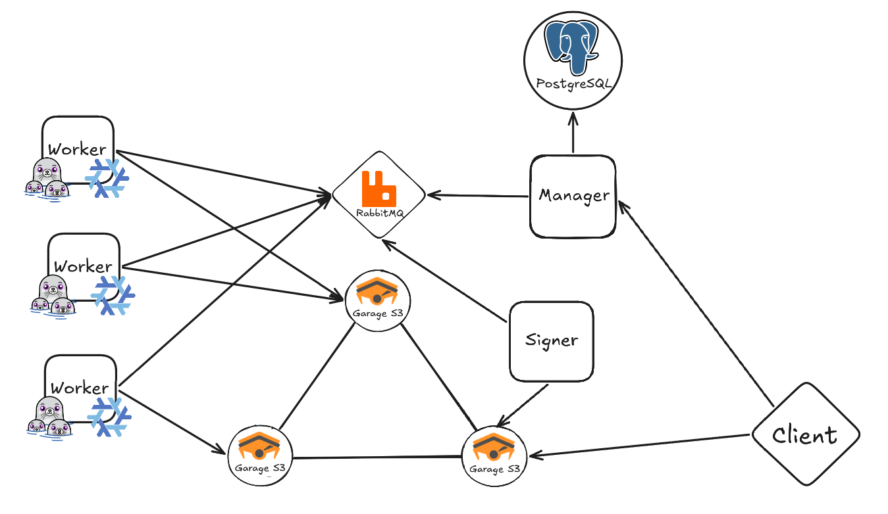

> [!CAUTION]
> **Free and Open-Source Android is under threat.**
>
> Google will turn Android into a locked-down platform, restricting your essential freedom to install apps of your choice. Make your voice heard.
>
> [**Keep Android Open**](https://keepandroidopen.org/).

<div align="center">
  
  
  <h1>Fullerene</h1>
  <p align="center">
  <a href="LICENSE"></a>
  
  
</p>
</div>
Android application build and delivery infrastructure focused on reproducibility, selfhostability, transparency, scalability and security.

> [!WARNING]
> The project is in the **Proof-Of-Concept**/**Pre-Alpha** stage.
> Not recommended for production use.

> [!IMPORTANT]
> Currently, the Fullerene project doesn't have working Nix derivations for a reproducible build of Android apps.
> 
> You can check the current progress or contribute in the [**android-packages**](https://github.com/fullerene-project/android-packages) repository.
> 
> If you're familiar with Nix, your help would be greatly appreciated.

# Key Features
- **First-class support for reproducible builds:** Fullerene uses Nix to create isolated and reproducible build environments.
- **Native APK splits support:** Support for modular Split APKs (Base, ABI, Density, Language, Asset Packs, Dynamic Features) alongside Standalone APKs.
- **Device-aware component selection:** Dynamically matches and serves the optimal application components based on client device characteristics.
- **Self-hostable:** Anyone can host their own Fullerene instance and use their own signing key.
- **No centralized store:** Works with any compatible application repositories.
- **Scalability:** Built on an event-driven microservices architecture, which allows for horizontal scaling.

# Table of Contents
- [System Architecture](#system-architecture)
- [Getting Started](#getting-started)
- [API Endpoints](#api-endpoints)
- [Nix Application Package Requirements](#nix-application-package-requirements)
- [Enumerations Reference](#enumerations-reference)
- [TODO](#todo)
- [Contributing](#contributing)
- [Licensing](#licensing)

# System architecture


#### Fullerene Manager
API and orchestration service.
- Exposes REST endpoints for clients.
- Clones Git repositories and evaluates Nix flake metadata.
- Resolves versions and queues build tasks.
- Tracks workflow events and maintains state in PostgreSQL.
- Generates presigned artifact download URLs.
#### Fullerene Worker
Build execution service.
- Consumes build tasks from RabbitMQ queues.
- Executes Nix package builds inside Podman containers.
- Validates output manifests, file sizes, and SHA-256 hashes.
- Uploads compiled unsigned APKs to S3 storage.
#### Fullerene Signer
Cryptographic key management and artifact signing service.
- Consumes signing tasks from RabbitMQ queues.
- Derives unique ECDSA private keys per application ID from a master seed using HKDF.
- Generates self-signed X.509 certificates and executes `apksigner` (v2/v4 signatures).
- Uploads signed APKs and `.idsig` files to S3 storage.
#### Infrastructure
- **PostgreSQL**: Stores information about nix repositories, application versions, artifacts, etc.
- **RabbitMQ**: Message broker managing inter-service communication.
- **Garage S3**: Object storage hosting unsigned and signed artifact buckets.

# Getting Started
**Requirements:**
- podman with podman compose

You can run it through Docker, but Podman is required on the host for the worker.

**Step 1: Clone repository**
```shell
git clone https://github.com/fullerene-project/code.git
cd code
```

**Step 2: Create .env files**
```shell
cp .env.db.example .env.db
cp .env.rabbitmq.example .env.rabbitmq
cp .env.garage.example .env.garage
cp .env.manager.example .env.manager
cp .env.worker.example .env.worker
cp .env.signer.example .env.signer
```

**Step 3: Edit `.env.db` `.env.rabbitmq` `.env.garage` files**
- Set Postgres and RabbitMQ secrets.
- Set Garage secrets in `.env.garage`. Generate secure hex tokens for `GARAGE_RPC_SECRET` and `GARAGE_ADMIN_TOKEN` using:
```shell
openssl rand -hex 32
```

**Step 4: Start infrastructure services**
```shell
podman compose up -d db rabbitmq garage
```

**Step 5: Run the Garage initialization script**
```shell
chmod +x setup_garage.sh
./setup_garage.sh
```

**Step 6: Edit `.env.manager` `.env.worker` `.env.signer`**
- Enter the corresponding keys obtained in the previous step, as well as other secrets.
- Generate a secure master seed for the signer service:
```shell
openssl rand -base64 64
```
  Set the generated string as `SigningSettings__MasterSeedBase64` in `.env.signer`.

**Step 7: Start application services**
```shell
podman compose up -d
```

# API Endpoints

### General Endpoints

#### `GET /license`
Retrieves project license links.
- **Response**: `200 OK`
```json
{
	"licenseTextUrl": "string",
    "licenseHtmlUrl": "string"
}
```

#### `GET /source-code`
Retrieves repository source code URL.
- **Response**: `200 OK`
```json
{
    "sourceCodeUrl": "string"
}
```
### Repositories (`/v1/repositories`)

#### `GET /v1/repositories`
Retrieves a paginated list of registered Nix package repositories.
- **Query Parameters**:
  - `SearchName` (string, optional): Fuzzy search query for repo name.
  - `Page` (integer, optional, default: `1`): Page number.
  - `PageSize` (integer, optional, default: `10`, max: `20`): Page size.
- **Response**: `200 OK`
```json
[
    {
      "id": "uuid",
      "name": "string",
      "gitRepositoryUrl": "string"
    }
]
```

#### `POST /v1/repositories`
Registers a new Nix package repository.
- **Request Body**:
```json
{
	"name": "string",
    "gitRepositoryUrl": "string"
}
```
- **Response**: `200 OK` (Returns the created repository entity)

#### `POST /v1/repositories/update`
Triggers an update check across all registered Nix package repositories.
- **Response**: `200 OK`

#### `POST /v1/repositories/{repoId}/update`
Triggers an update check for a specific Nix package repository by ID.
- **Path Parameters**:
  - `repoId` (uuid, required): Repository ID.
- **Response**: `200 OK`
### Applications (`/v1/apps`)

#### `GET /v1/apps`
Retrieves a paginated list of Android application packages.
- **Query Parameters**:
  - `AndroidAppPackageIds` (array of uuid, optional): Filter by application package IDs.
  - `NixPackageRepoIds` (array of uuid, optional): Filter by repository IDs.
  - `NixPackageNames` (array of string, optional): Filter by Nix package names.
  - `AndroidApplicationIds` (array of string, optional): Filter by Android Application IDs (package names).
  - `IsTracked` (boolean, optional): Filter by tracking status.
  - `SearchName` (string, optional): Fuzzy search query for application name.
  - `Page` (integer, optional, default: `1`): Page number.
  - `PageSize` (integer, optional, default: `20`, max: `30`): Page size.
- **Response**: `200 OK`
```json
[
    {
      "id": "uuid",
      "nixPackageRepoId": "uuid",
      "nixPackageName": "string",
      "androidApplicationId": "string",
      "isTracked": true,
      "appLogoUrl": "string",
      "appName": "string",
      "appSummary": "string",
      "appDescription": "string",
      "appLicense": "string"
    }
]
```

#### `POST /v1/apps/{appId}/track`
Enables version tracking for a specific application package.
- **Path Parameters**:
  - `appId` (uuid, required): Application ID.
- **Response**: `200 OK`

#### `PATCH /v1/apps/latest`
Resolves and retrieves download links for the latest suitable signed artifacts for a given application based on client device parameters.
- **Request Body**:
```json
{
    "appId": "uuid",
    "clientDeviceInfo": {
      "cpuArchitecture": integer,
      "apiVersion": integer,
      "locales": ["string"],
      "textureCompressionFormats": [integer],
      "screenDensityDpi": integer,
      "screenDensityAlias": integer
    },
    "releaseChannels": [integer],
    "currentBaseVersionCode": integer,
    "standaloneApkOnly": boolean
}
```
 *Note on Enum values:*
  See [Enumerations Reference](#enumerations-reference) for integer mappings (`releaseChannels`, `cpuArchitecture`, `textureCompressionFormats`, `screenDensityAlias`).
- **Response**: `200 OK`
```json
[
    {
      "apkFileData": {
        "downloadUrl": "string",
        "fileName": "string",
        "fileSha256": "string",
        "fileSizeBytes": 0
      },
      "apkIdSigFileData": {
        "downloadUrl": "string",
        "fileName": "string",
        "fileSha256": "string",
        "fileSizeBytes": 0
      }
    }
]
```
### Versions (`/v1/versions`)

#### `GET /v1/versions`
Retrieves a paginated list of Android application package versions.
- **Query Parameters**:
  - `AndroidAppPackageIds` (array of uuid, optional): Filter by application package IDs.
  - `AndroidAppPackageVersionIds` (array of uuid, optional): Filter by application package version IDs.
  - `ReleaseChannels` (array of integer, optional): Filter by release channels (see [Enumerations Reference](#enumerations-reference)).
  - `BaseVersionCodes` (array of integer, optional): Filter by base version codes.
  - `MinBaseVersionCode` (integer, optional): Filter by minimum base version code.
  - `MaxBaseVersionCode` (integer, optional): Filter by maximum base version code.
  - `Page` (integer, optional, default: `1`): Page number.
  - `PageSize` (integer, optional, default: `10`, max: `20`): Page size.
- **Response**: `200 OK`
```json
[
    {
      "id": "uuid",
      "nixPackageRepoId": "uuid",
      "commitHash": "string",
      "nixPackageName": "string",
      "androidApplicationId": "string",
      "appVersionString": "string",
      "baseVersionCode": 0,
      "nixPackageRevision": 0,
      "nixDerivationHash": "string",
      "releaseChannel": 10,
      "appVersionReleaseDate": "2026-08-01T00:00:00Z",
      "appLogoUrl": "string",
      "appName": "string",
      "appSummary": "string",
      "appDescription": "string",
      "appLicense": "string",
      "releaseNotes": "string"
    }
]
```

#### `PATCH /v1/versions/download`
Resolves and retrieves download links for signed artifacts of a specific version based on client device parameters.
- **Request Body**:
```json
{
    "versionId": "uuid",
    "standaloneApkOnly": boolean,
    "clientDeviceInfo": {
      "cpuArchitecture": integer,
      "apiVersion": integer,
      "locales": ["string"],
      "textureCompressionFormats": [integer],
      "screenDensityDpi": integer,
      "screenDensityAlias": integer
    }
}
```
- **Response**: `200 OK`
```json
[
    {
      "apkFileData": {
        "downloadUrl": "string",
        "fileName": "string",
        "fileSha256": "string",
        "fileSizeBytes": 0
      },
      "apkIdSigFileData": {
        "downloadUrl": "string",
        "fileName": "string",
        "fileSha256": "string",
        "fileSizeBytes": 0
      }
    }
]
```
### Artifacts (`/v1/artifacts`)

#### `GET /v1/artifacts`
Retrieves a paginated list of compiled artifacts.
- **Query Parameters**:
  - `AndroidAppPackageIds` (array of uuid, optional): Filter by application IDs.
  - `BuildWorkflowIds` (array of uuid, optional): Filter by build workflow IDs.
  - `ReleaseChannels` (array of integer, optional): Filter by release channels (see [Enumerations Reference](#enumerations-reference)).
  - `ArtifactTypes` (array of integer, optional): Filter by artifact types (see [Enumerations Reference](#enumerations-reference)).
  - `IsSigned` (boolean, optional): Filter by tracking status.
  - `Page` (integer, optional, default: `1`): Page number.
  - `PageSize` (integer, optional, default: `10`, max: `20`): Page size.
- **Response**: `200 OK`
```json
[
	{
	  "id": "uuid",
	  "buildWorkflowId": "uuid",
	  "isSigned": true,
	  "fileData": {
		"fileStorageKey": "string",
		"fileName": "string",
		"fileSha256": "string",
		"fileSizeBytes": 0
	  },
	  "idSigFileData": {
		"fileStorageKey": "string",
		"fileName": "string",
		"fileSha256": "string",
		"fileSizeBytes": 0
	  },
	  "meta": {
		"artifactType": integer,
		"versionCode": integer,
		"minApiLevel": integer,
		"targetApiLevel": integer,
		"splitId": "string",
		"moduleName": "string",
		"cpuArchitectures": [integer],
		"deliveryType": integer,
		"assetModuleType": integer,
		"textureCompressionFormat": integer,
		"languageTargeting": "string",
		"densityAlias": integer,
		"densityDpi": integer
	  }
	}
]
```

#### `GET /v1/artifacts/{artifactId}/download`
Generates temporary presigned download URLs for a specific signed artifact and its signature file (`.idsig`).
- **Path Parameters**:
  - `artifactId` (uuid, required): Artifact ID.
- **Response**: `200 OK`
```json
{
	"apkFileData": {
	  "downloadUrl": "string",
	  "fileName": "string",
	  "fileSha256": "string",
	  "fileSizeBytes": 0
	},
	"apkIdSigFileData": {
	  "downloadUrl": "string",
	  "fileName": "string",
	  "fileSha256": "string",
	  "fileSizeBytes": 0
	}
}
```

# Nix Application Package Requirements
For compatibility with the Fullerene system, Nix flakes and derivations must satisfy requirements regarding flake exports, package metadata, and build output (`$out`) directory structure.
## 1. Flake Structure
Packages must be exported in the Flake output under the `x86_64-linux` architecture path:
```
packages.x86_64-linux.<packageName>
```
## 2. Package Metadata (`passthru`)
The package derivation must expose metadata attributes via the `passthru` attribute set:

| `passthru` Attribute   | Type    | Description                                                             | Required |
| :--------------------- | :------ | :---------------------------------------------------------------------- | :------- |
| `androidApplicationId` | String  | Unique Android Application ID (e.g., `com.example.app`)                 | Yes      |
| `appName`              | String  | Full display name of the application                                    | Yes      |
| `appSummary`           | String  | Short summary of the application                                        | Yes      |
| `appDescription`       | String  | Detailed description of the application                                 | Yes      |
| `appLicense`           | String  | License identifier (e.g., `AGPL-3.0`)                                   | Yes      |
| `logoUrl`              | String  | Direct URL link to the application logo                                 | Yes      |
| `baseVersionCode`      | Integer | Numeric base version code                                               | Yes      |
| `appVersionString`     | String  | Version string representation (e.g., `1.0.0`)                           | Yes      |
| `releaseChannel`       | Integer | Release channel (see [Enumerations Reference](#enumerations-reference)) | Yes      |
| `appReleaseDate`       | String  | Release timestamp in ISO 8601 format                                    | Yes      |
| `nixPackageRevision`   | Integer | Nix package revision number                                             | Yes      |
| `releaseNotes`         | String  | Release notes / Changelog text                                          | Optional |
Nix Expression Example:
```nix
stdenv.mkDerivation {
  pname = "example-app";
  version = "1.0.0";

  # ... build logic ...

  passthru = {
    androidApplicationId = "org.example.app";
    appName = "Example App";
    appSummary = "Short summary of the app";
    appDescription = "Detailed description of the app";
    appLicense = "AGPL-3.0";
    logoUrl = "https://example.com/logo.png";
    baseVersionCode = 100;
    appVersionString = "1.0.0";
    releaseChannel = 10;
    appReleaseDate = "2026-07-25T00:00:00Z";
    nixPackageRevision = 1;
    releaseNotes = "Initial release";
  };
}
```
## 3. Build Output Requirements (`$out`)
Upon build completion, the derivation's output directory (`$out`) must contain:
1. Unsigned APK files (`*.apk`).
2. A build manifest file named `manifest.json`.
### `manifest.json` Schema
The file must be located at the root of `$out` and adhere to the following structure:
```json
{
  "releaseChannel": 10,
  "entries": [
    {
      "fileName": "app-universal-release-unsigned.apk",
      "fileSha256": "e3b0c44298fc1c149afbf4c8996fb92427ae41e4649b934ca495991b7852b855",
      "fileSizeBytes": 15420100,
      "artifactType": 1,
      "versionCode": 100,
      "minApiLevel": 21,
      "targetApiLevel": 34,
      "splitId": null,
      "moduleName": null,
      "cpuArchitectures": [3, 5],
      "singleCpuArchitecture": null,
      "densityAlias": null,
      "densityDpi": null,
      "languageTargeting": null,
      "deliveryType": null,
      "assetModuleType": null,
      "textureCompressionFormat": null
    }
  ]
}
```

# Enumerations Reference

This section lists all numeric enum values used across the Fullerene REST API requests, responses, and build `manifest.json` files.
### ReleaseChannel
| Value | Identifier | Description |
| :--- | :--- | :--- |
| `10` | `Stable` | Production-ready builds |
| `20` | `Beta` | Beta testing releases |
| `30` | `Alpha` | Alpha experimental builds |
### ArtifactType
| Value | Identifier            | Description                                                            |
| :---- | :-------------------- | :--------------------------------------------------------------------- |
| `1`   | `StandaloneUniversal` | Universal standalone APK containing code and resources for all targets |
| `2`   | `StandaloneSingleAbi` | Standalone APK built for a single specific CPU architecture            |
| `3`   | `BaseSplit`           | Base module split APK for Android App Bundle architecture              |
| `4`   | `AbiSplit`            | Native library CPU architecture split APK                              |
| `5`   | `DensitySplit`        | Screen density resources split APK                                     |
| `6`   | `LanguageSplit`       | Language/locale resources split APK                                    |
| `7`   | `AssetsSplit`         | Asset pack split APK                                                   |
| `8`   | `FeatureSplit`        | Dynamic feature module split APK                                       |
### CpuArchitecture
| Value | Identifier | ABI Target |
| :--- | :--- | :--- |
| `1` | `Armeabi` | `armeabi` |
| `2` | `ArmeabiV7a` | `armeabi-v7a` |
| `3` | `Arm64V8a` | `arm64-v8a` |
| `4` | `X86` | `x86` |
| `5` | `X86_64` | `x86_64` |
| `6` | `Mips` | `mips` |
| `7` | `Mips64` | `mips64` |
| `8` | `RiscV64` | `riscv64` |
### ScreenDensityAlias
| Value | Identifier | Target Density |
| :--- | :--- | :--- |
| `1` | `NODPI` | Any density (`nodpi` / 0 dpi) |
| `2` | `LDPI` | Low density (`ldpi` / ~120 dpi) |
| `3` | `MDPI` | Medium density (`mdpi` / ~160 dpi) |
| `4` | `TVDPI` | TV density (`tvdpi` / ~213 dpi) |
| `5` | `HDPI` | High density (`hdpi` / ~240 dpi) |
| `6` | `XHDPI` | Extra high density (`xhdpi` / ~320 dpi) |
| `7` | `XXHDPI` | Extra extra high density (`xxhdpi` / ~480 dpi) |
| `8` | `XXXHDPI` | Extra extra extra high density (`xxxhdpi` / ~640 dpi) |
### DeliveryType
| Value | Identifier | Description |
| :--- | :--- | :--- |
| `1` | `InstallTime` | Delivered during app installation |
| `2` | `OnDemand` | Downloaded on demand when requested by the app |
| `3` | `FastFollow` | Automatically downloaded immediately after app installation |
### AssetModuleType
| Value | Identifier | Description |
| :--- | :--- | :--- |
| `1` | `DefaultAssetType` | Standard asset pack module |
| `2` | `AIPackType` | AI/ML model or data asset pack module |
### FeatureModuleType
| Value | Identifier | Description |
| :--- | :--- | :--- |
| `1` | `FeatureModule` | Standard dynamic feature module |
| `2` | `MLModule` | Machine learning model feature module |
| `3` | `SdkModule` | Dynamic SDK dependency module |
### TextureCompressionFormat
| Value | Identifier     | Description                           |
| :---- | :------------- | :------------------------------------ |
| `0`   | `UNCOMPRESSED` | Uncompressed textures                 |
| `1`   | `ETC1_RGB8`    | Ericsson Texture Compression (ETC1)   |
| `2`   | `PALETTED`     | Paletted textures                     |
| `3`   | `THREE_DC`     | ATI 3Dc compression                   |
| `4`   | `ATC`          | Qualcomm AMD/ATI Texture Compression  |
| `5`   | `LATC`         | Luminance-Alpha Texture Compression   |
| `6`   | `DXT1`         | S3 Texture Compression (DXT1 / BC1)   |
| `7`   | `S3TC`         | General S3TC / DXT compression        |
| `8`   | `PVRTC`        | PowerVR Texture Compression           |
| `9`   | `ASTC`         | Adaptive Scalable Texture Compression |
| `10`  | `ETC2`         | Ericsson Texture Compression 2 (ETC2) |

# TODO
- Implement build certification, possibly SLSA/SBOM
- Authentication/Authorization
- Use retry policies
- Use specific custom exceptions instead of the generic Exception
- Background tasks for clearing the nix cache, updating repositories, and removing old artifacts
- Save and stream logs in real time
- Key rotation support (apk signing v3)
- UnifiedPush support for notifying client applications about updates
- Kubernetes deployment
- If possible, replace calls to Play Feature Delivery and Play Asset Delivery to download additional features and assets after installation.
- Many many other things

# Contributing
Any contribution is welcome and greatly appreciated.
However, **please do not submit issues or pull requests written by AI/LLM**.

**Needed Help:**
- Developing Android app build tooling in Nix
- Writing Nix build expressions
- Optimizing Nix cache management
- Developing a full-featured modern Android client in Kotlin
- Writing tests
- Developing a simple web frontend

# Licensing
Copyright (C) 2026 The Fullerene Contributors

This file is part of Fullerene.

Fullerene is free software: you can redistribute it and/or modify it under the terms of the GNU Affero General Public License as published by the Free Software Foundation, only version 3 of the License.

Fullerene is distributed in the hope that it will be useful, but WITHOUT ANY WARRANTY; without even the implied warranty of MERCHANTABILITY or FITNESS FOR A PARTICULAR PURPOSE. See the GNU Affero General Public License for more details.

You should have received a copy of the GNU Affero General Public License along with Fullerene. If not, see <https://www.gnu.org/licenses/>. 